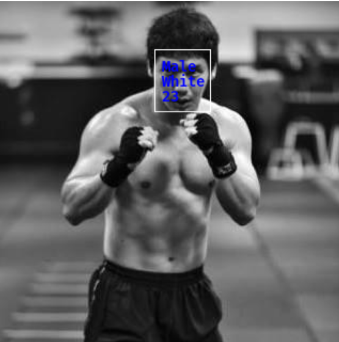

# Human Face Analyzer
A model that detects human faces and predicts age, gender and race.
Will be implemented by TensorFlow 2. 
 
tmp image 

## Dataset
- for face detection 
  [WIDER FACE: A Face Detection Benchmark](http://shuoyang1213.me/WIDERFACE/)
- for age, gender and race predictions 
  [UTKFace](https://susanqq.github.io/UTKFace/)
  
## References
- Paper
  - [Xception: Deep Learning with Depthwise Separable Convolutions](https://arxiv.org/abs/1610.02357) 
  - [Deep Residual Learning for Image Recognition](https://arxiv.org/abs/1512.03385) 
- Repos
  - https://github.com/yanchummar/xception-keras 
  - https://github.com/raghakot/keras-resnet 
